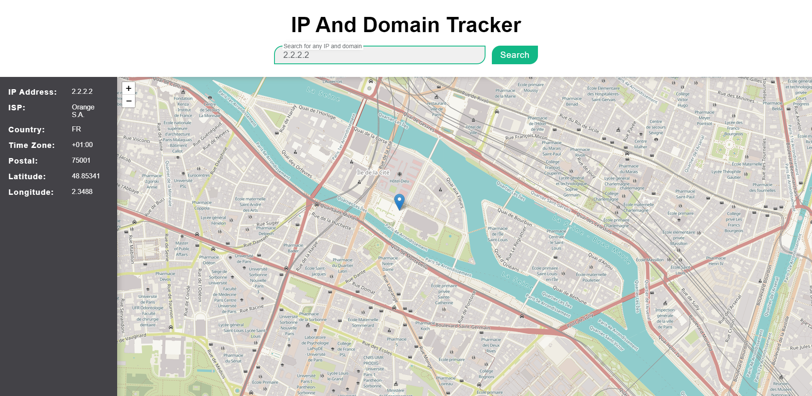
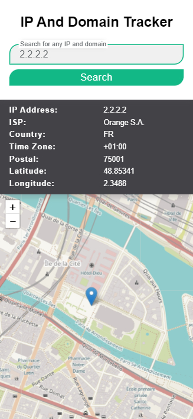

# IP address and domain tracker solution

## Table of contents

- [Overview](#overview)
  - [The challenge](#the-challenge)
  - [Screenshot](#screenshot)
  - [Links](#links)
- [My process](#my-process)
  - [Built with](#built-with)
 - [Author](#author)

## Overview

### The challenge

Users should be able to:

- View the optimal layout for each page depending on their device's screen size
- See hover states for all interactive elements on the page
- See their own IP address on the map on the initial page load
- Search for any IP addresses and see the key information and location

### Screenshot

 

### Links

- Solution URL: (https://github.com/AlgirdasU/Domain-address-tracker)
- Live Site URL: (https://silver-tiramisu-bc01e0.netlify.app/)
## My process

### Built with

- Semantic HTML5 markup
- CSS custom properties
- SCSS
- Flexbox
- CSS Grid
- BEM
- JS

## Author

- Website - [Algirdas](https://github.com/AlgirdasU/Domain-address-tracker)
- Twitter - [@AlgirdasDdd](https://twitter.com/algirdasddd)

